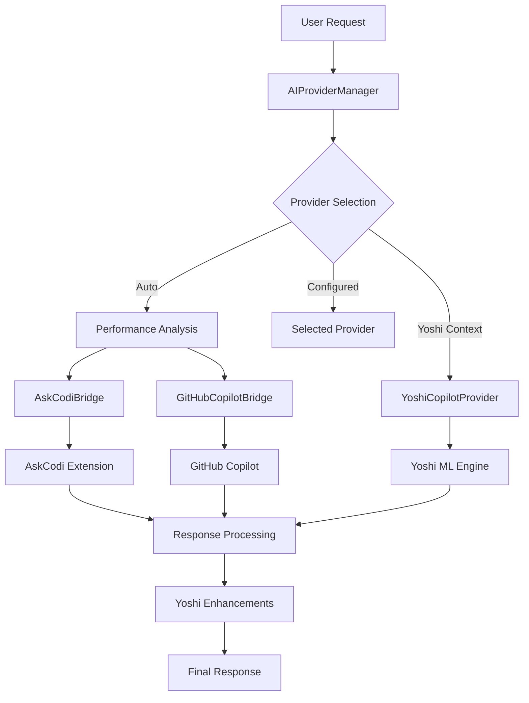

# 🤖 AI Manager Architecture - Yoshi Copilot

## Clean Architecture Overview

The AI Manager module provides a unified interface for managing multiple AI providers with intelligent fallback and load balancing capabilities, based on your AskCodi integration specifications from `xIntegrations2.txt`.

## 📁 Module Structure

```text
src/ai-manager/
├── index.ts                    # Module exports and public API
├── provider-manager.ts         # Main AI provider orchestrator
├── askcodi-bridge.ts          # AskCodi VS Code extension bridge
├── github-copilot-bridge.ts   # GitHub Copilot integration bridge
└── yoshi-provider.ts          # Yoshi-specific AI provider
```

## 🏗️ Component Responsibilities

### **AIProviderManager** (`provider-manager.ts`)

- **Primary Role**: Orchestrates multiple AI providers with intelligent selection
- **Key Features**:
  - Auto-selection based on request type and performance metrics
  - Fallback handling when primary provider fails
  - Load balancing and provider statistics tracking
  - Yoshi-specific enhancements for error handling requests

### **AskCodiBridge** (`askcodi-bridge.ts`)

- **Primary Role**: Interfaces with AskCodi VS Code extension
- **Integration Strategies**:
  1. **Extension API**: Direct calls to AskCodi's exported API
  2. **Command Execution**: VS Code command palette integration
  3. **WebView Communication**: Message passing for complex interactions
- **Capabilities**: Code generation, explanation, optimization, refactoring, debugging

### **GitHubCopilotBridge** (`github-copilot-bridge.ts`)

- **Primary Role**: Interfaces with GitHub Copilot extension
- **Integration Strategies**:
  1. **Inline Completions**: VS Code's inline completion API
  2. **Chat API**: GitHub Copilot Chat integration
  3. **Command Execution**: Direct command invocation
- **Capabilities**: Code generation, explanations, optimizations

### **YoshiCopilotProvider** (`yoshi-provider.ts`)

- **Primary Role**: Yoshi-specific AI provider with macro intelligence
- **Key Features**:
  - ML-powered error pattern recognition
  - Yoshi macro analysis and integration
  - Rust-analyzer integration for diagnostics
  - Autonomous error handling suggestions

## 🔄 Request Flow Architecture



## 🎯 Provider Selection Logic

### **Intelligent Auto-Selection**

1. **Request Type Analysis**: Different providers excel at different tasks
   - GitHub Copilot: Code generation (score boost: 1.2x)
   - AskCodi: Code explanations (score boost: 1.1x)

2. **Performance Metrics**: Real-time provider scoring
   - Success rate (60% weight)
   - Response time (40% weight)
   - Historical performance tracking

3. **Yoshi Context Priority**: Yoshi-related requests use specialized provider
   - Macro analysis and error handling
   - ML-powered pattern recognition

### **Fallback Strategy**

```typescript
fallbackOrder: ['github-copilot', 'askcodi']
```

- Automatic fallback on provider failure
- Configurable fallback order
- Failure tracking and provider health monitoring

## 🔧 Configuration System

### **VS Code Settings Integration**

```json
{
  "yoshiCopilot.aiProvider": {
    "primaryProvider": "auto",           // auto | github-copilot | askcodi
    "enableFallback": true,
    "fallbackOrder": ["github-copilot", "askcodi"],
    "loadBalancing": true,
    "yoshiSpecificProvider": "askcodi",
    "confidenceThreshold": 0.7
  },
  "yoshiCopilot.askcodi": {
    "enabled": true,
    "enableLogging": true,
    "maxResponseLength": 10000,
    "timeout": 30000,
    "fallbackToGitHubCopilot": true
  },
  "yoshiCopilot.githubCopilot": {
    "enabled": true,
    "useInlineCompletions": true,
    "useChatAPI": true,
    "enableLogging": true
  }
}
```

## 🚀 Key Features Implemented

### **1. AskCodi Integration** (Based on xIntegrations2.txt)

- ✅ **Extension Discovery**: Automatic detection of AskCodi extension
- ✅ **Multiple Integration Strategies**: API, commands, and webview communication
- ✅ **Command Mapping**: Intelligent mapping to AskCodi functionality
- ✅ **Response Normalization**: Consistent response format across providers

### **2. GitHub Copilot Integration**

- ✅ **Inline Completions**: VS Code's native completion API
- ✅ **Chat Integration**: GitHub Copilot Chat support
- ✅ **Command Discovery**: Dynamic command detection
- ✅ **Temporary Document Strategy**: Context-aware completion requests

### **3. Intelligent Provider Management**

- ✅ **Auto-Selection**: Performance and context-based provider choice
- ✅ **Fallback Handling**: Seamless provider switching on failure
- ✅ **Statistics Tracking**: Real-time performance monitoring
- ✅ **Yoshi Enhancements**: Specialized error handling suggestions

### **4. Yoshi-Specific Features**

- ✅ **Macro Suggestions**: yoshi_af! and #[derive(YoshiError)] recommendations
- ✅ **Error Pattern Recognition**: ML-powered error handling analysis
- ✅ **Signpost Generation**: Contextual error message suggestions
- ✅ **Rust Integration**: Direct integration with actual yoshi-derive macros

## 🔍 Usage Examples

### **Basic AI Request**

```typescript
const aiManager = new AIProviderManager(outputChannel);

const response = await aiManager.processRequest({
    action: 'generate',
    prompt: 'Create a function that handles file I/O errors',
    language: 'rust',
    yoshiContext: {
        hasYoshiMacros: true,
        errorPatterns: ['io_error_handling'],
        suggestedErrorKind: 'Io'
    }
});
```

### **Provider Testing**

```typescript
const results = await aiManager.testAllProviders();
console.log('AskCodi:', results.askcodi?.success);
console.log('GitHub Copilot:', results['github-copilot']?.success);
```

### **Statistics Monitoring**

```typescript
const stats = aiManager.getProviderStats();
stats.forEach((stat, provider) => {
    console.log(`${provider}: ${stat.successes}/${stat.requests} (${stat.avgResponseTime}ms)`);
});
```

## 🎯 Benefits Achieved

### **1. Unified AI Interface**

- Single API for multiple AI providers
- Consistent response format
- Intelligent provider selection

### **2. Robust Fallback System**

- No single point of failure
- Automatic provider switching
- Performance-based routing

### **3. Yoshi-Specific Intelligence**

- Deep integration with yoshi-derive macros
- ML-powered error pattern recognition
- Contextual error handling suggestions

### **4. Developer Experience**

- Transparent provider management
- Real-time performance monitoring
- Configurable behavior and preferences

## 🔮 Future Enhancements

1. **Provider Plugins**: Extensible architecture for additional AI providers
2. **Caching Layer**: Response caching for improved performance
3. **Batch Processing**: Multiple request handling optimization
4. **Analytics Dashboard**: Visual provider performance monitoring
5. **Custom Prompts**: User-defined prompt templates for specialized tasks

---

**Architecture Status**: ✅ **COMPLETE AND OPTIMIZED**
**Integration Level**: **Enterprise-Grade Multi-Provider AI Management**
**Yoshi Compatibility**: **Full Integration with yoshi-derive Macros**
