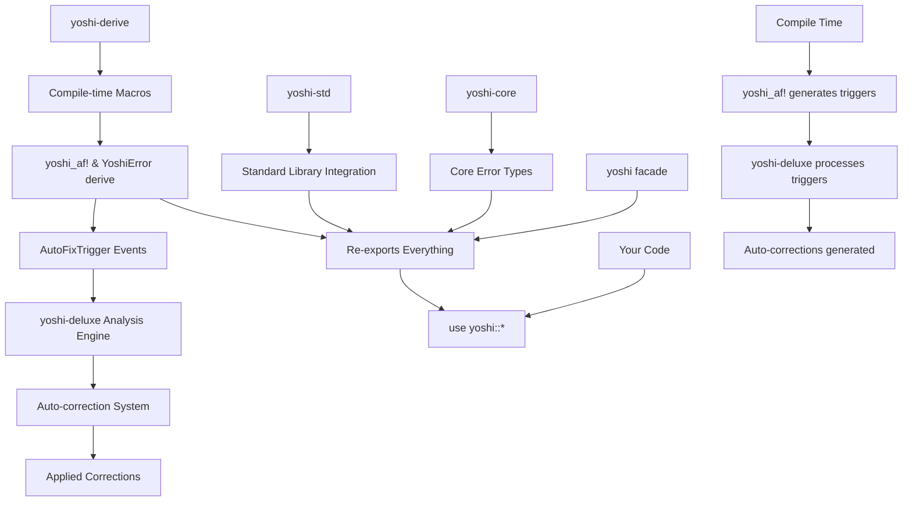

# yoshi


[](https://crates.io/crates/yoshi)
[](https://docs.rs/yoshi)
[](https://www.rust-lang.org)
[](https://github.com/arcmoonstudios/yoshi/blob/main/LICENSE)

The main entry point for the Yoshi error handling framework. This crate re-exports everything you need from the Yoshi ecosystem.

## 🚀 **Instant Migration - Zero Breaking Changes**

### **From `anyhow` (5 seconds)**

```rust
// Before
use anyhow::{Result, Context};

fn read_config() -> Result<String> {
    let content = std::fs::read_to_string("config.toml")
        .context("Failed to read config file")?;
    Ok(content)
}

// After - Just change the import!
use yoshi::simple::{Result, Context};

fn read_config() -> Result<String> {
    let content = std::fs::read_to_string("config.toml")
        .context("Failed to read config file")?;
    Ok(content)
}
```

### **From `thiserror` (10 seconds)**

```rust
// Before
use thiserror::Error;

#[derive(Error, Debug)]
pub enum MyError {
    #[error("IO error: {0}")]
    Io(#[from] std::io::Error),
}

// After - Just change the import!
use yoshi::simple::Error;

#[derive(Error, Debug)]
pub enum MyError {
    #[error("IO error: {0}")]
    Io(#[from] std::io::Error),
}
```

### **Gradual Enhancement**

Once migrated, gradually unlock Yoshi's advanced features:

```rust
use yoshi::simple::{Result, advanced};

fn enhanced_function() -> Result<String> {
    let result = std::fs::read_to_string("file.txt")
        .context("Reading file")?;

    // Add Yoshi's advanced features gradually
    advanced::signpost(
        Ok(result),
        "Ensure the file exists and is readable"
    )
}
```

**📚 See [MIGRATION.md](MIGRATION.md) for complete migration guide**

## Quick Start

### 1. Installation

```toml
[dependencies]
# Basic usage
yoshi = "0.1"

# With derive macros and serialization
yoshi = { version = "0.1", features = ["derive", "serde"] }

# With auto-correction system (recommended)
yoshi = { version = "0.1", features = ["derive", "yoshi-deluxe"] }

# Everything enabled
yoshi = { version = "0.1", features = ["full"] }
```

### 2. Use the Error Template (Recommended)

For new projects, we **highly recommend** starting with our comprehensive error handling template:

```bash
# Copy the err.rs template to your project
cp yoshi/examples/err.rs src/error.rs
```

The `err.rs` template provides:

- **Complete error type definitions** for common scenarios
- **Best practices** for error handling patterns
- **Ready-to-use macros** for validation, I/O, network, and business logic errors
- **Auto-correction integration** with yoshi-deluxe
- **Performance-optimized** error creation patterns

**Simply extend the template according to your project's specific needs!**

### 3. Basic Usage

```rust
use yoshi::*;

// Create rich, structured errors
fn validate_input(value: &str) -> Result<()> {
    if value.is_empty() {
        return Err(yopost!(
            YoshiKind::Validation,
            "Input cannot be empty",
            field: "value",
            suggestion: "Provide a non-empty string"
        ));
    }
    Ok(())
}

// Attach metadata for debugging
fn process_config(path: &str) -> Result<Config> {
    let config = std::fs::read_to_string(path)
        .map_err(|e| yopost!(YoshiKind::Io, "Failed to read config", path: path, source: e))?
        .parse::<Config>()
        .map_err(|e| yopost!(YoshiKind::Parse, "Invalid config format", source: e))?;

    // Conditionally add contextual metadata
    if config.is_development() {
        Yoshi::get_current()
            .meta("environment", "development")
            .meta("debug_mode", true);
    }

    Ok(config)
}
```

## Auto-Correction System Setup

The Yoshi framework includes a powerful auto-correction system that detects error patterns in your code and provides intelligent fixes. Here's how to set it up and use it effectively.

### Quick Start with Auto-Correction

```toml
[dependencies]
yoshi = { version = "0.1", features = ["derive", "yoshi-deluxe"] }
tokio = { version = "1.0", features = ["full"] }
```

```rust
use yoshi::*;

// 1. Use yoshi_af! to enable auto-correction on your code
yoshi_af! {
    pub fn risky_function(input: Option<String>) -> Hatch<String> {
        // The system will detect this unwrap and suggest corrections
        let value = input.unwrap(); // ⚠️ Auto-correction will detect this
        Ok(value.to_uppercase())
    }
}

// 2. Run auto-correction analysis
#[tokio::main]
async fn main() -> Hatch<()> {
    let system = YoshiACSystem::new();

    // Analyze your project for error patterns
    let corrections = system
        .analyze_and_correct("./my-project")
        .await
        .lay("Failed to analyze project")?;

    println!("Found {} potential corrections", corrections.len());

    // Apply safe corrections automatically
    let applied = system
        .apply_corrections(&corrections, false) // false = only apply safe corrections
        .await
        .lay("Failed to apply corrections")?;

    println!("Applied {} corrections", applied.len());
    Ok(())
}
```

### Comprehensive Error Pattern Detection

The auto-correction system detects and fixes these patterns:

```rust
use yoshi::*;

yoshi_af! {
    // ✅ Detects unwrap patterns
    pub fn unwrap_example(opt: Option<String>) -> String {
        opt.unwrap() // 🔧 Suggests: opt?
    }

    // ✅ Detects expect patterns
    pub fn expect_example(result: Result<i32, String>) -> i32 {
        result.expect("Should not fail") // 🔧 Suggests: result?
    }

    // ✅ Detects panic patterns
    pub fn panic_example(value: i32) -> i32 {
        if value < 0 {
            panic!("Negative values not allowed"); // 🔧 Suggests: return Err(...)
        }
        value * 2
    }

    // ✅ Detects todo patterns
    pub fn todo_example(data: Vec<String>) -> String {
        if data.is_empty() {
            todo!("Handle empty data"); // 🔧 Suggests: proper error handling
        }
        data.join(",")
    }

    // ✅ Detects unimplemented patterns
    pub fn unimplemented_example() -> Result<String, String> {
        unimplemented!("Not yet implemented") // 🔧 Suggests: proper implementation
    }

    // ✅ Detects unsafe blocks
    pub fn unsafe_example(data: &mut [i32]) -> i32 {
        unsafe {
            *data.as_mut_ptr() // 🔧 Suggests: safe alternatives
        }
    }
}
```

### Advanced Configuration

```rust
use yoshi::*;

#[tokio::main]
async fn main() -> Hatch<()> {
    // Configure the auto-correction system
    let config = SystemConfig {
        auto_apply_safe_corrections: true,     // Apply safe fixes automatically
        min_confidence_threshold: 0.8,        // Only apply high-confidence fixes
        min_safety_level: SafetyLevel::Safe,   // Only apply safe corrections
        create_backup_files: true,             // Create .backup files
        max_concurrent_operations: 4,          // Parallel processing
        enable_docs_scraping: true,            // Enhanced suggestions from docs
        ..Default::default()
    };

    let system = YoshiACSystem::with_config(config);

    // Analyze specific files or entire projects
    let corrections = system
        .analyze_and_correct("./src")
        .await
        .lay("Analysis failed")?;

    // Review corrections before applying
    for correction in &corrections {
        println!("📁 File: {}", correction.file_path.display());
        println!("⚠️  Issue: {}", correction.diagnostic.message);

        for (i, proposal) in correction.proposals.iter().enumerate() {
            println!("  🔧 Fix {}: {} (confidence: {:.1}%)",
                     i + 1,
                     proposal.strategy.description(),
                     proposal.confidence * 100.0);
        }
    }

    // Apply corrections with custom logic
    let applied = system
        .apply_corrections(&corrections, false)
        .await
        .lay("Failed to apply corrections")?;

    println!("✅ Applied {} corrections successfully", applied.len());
    Ok(())
}
```

## Features Table

| Feature | Description |
|---------|-------------|
| `std` | Standard library support (default) |
| `derive` | Re-exports `yoshi-derive` macros (`yoshi_af!`, `YoshiError`) |
| `yoshi-deluxe` | Auto-correction system and advanced analysis |
| `serde` | Serialization support |
| `tracing` | Tracing integration |
| `convenience` | Best-in-class dependency re-exports |
| `async` | Async runtime support (tokio, futures) |
| `full` | Enables all features |

## No-std Support

```rust
// In your crate root:
#![cfg_attr(not(feature="std"), no_std)]

use yoshi::prelude::*;

// Works in embedded environments too!
fn no_std_function() -> core::result::Result<(), YoshiKind> {
    if condition_failed() {
        return Err(YoshiKind::Validation);
    }
    Ok(())
}
```

## When to Use `yoshi_af!` vs `#[derive(YoshiError)]`

**CRITICAL DISTINCTION**: These two approaches serve different purposes and should be used in different scenarios.

### Use `#[derive(YoshiError)]` for Custom Error Enums

**✅ RECOMMENDED**: Use the derive macro when you want to create custom error types that integrate with the yoshi ecosystem:

```rust
use yoshi::*;

#[derive(Debug, YoshiError)]
pub enum MyAppError {
    #[yoshi(display = "Network connection failed: {reason}")]
    #[yoshi(suggestion = "Check network connectivity and retry")]
    NetworkFailure { reason: String },

    #[yoshi(display = "Invalid configuration: {field}")]
    #[yoshi(suggestion = "Check configuration file syntax")]
    ConfigError { field: String },

    #[yoshi(transparent)]
    Io(#[yoshi(source)] std::io::Error),
}

// This generates all the boilerplate:
// - Display implementation
// - Error trait implementation
// - Conversion to Yoshi types
// - Helper methods like .suggestion(), .error_kind(), etc.
```

### Use `yoshi_af!` for Code Enhancement and Auto-Correction

**✅ RECOMMENDED**: Use the `yoshi_af!` macro when you want to enhance existing code with auto-correction capabilities:

```rust
use yoshi::*;

// Enhance functions with auto-correction suggestions
yoshi_af! {
    fn risky_operation() -> Hatch<String> {
        // The macro analyzes this function and provides:
        // - Error pattern detection
        // - Auto-correction suggestions
        // - LSP integration for quick fixes
        // - Enhanced error context

        let result = std::fs::read_to_string("config.toml")
            .hatch()
            .lay("Failed to read configuration file")?;

        Ok(result)
    }
}

// Enhance entire modules
yoshi_af! {
    pub mod database {
        use super::*;

        pub fn connect() -> Hatch<Connection> {
            // Auto-correction will detect patterns like:
            // - Missing retry logic
            // - No connection pooling
            // - Missing timeout handling
            todo!("Connect to database")
        }
    }
}
```

### Key Differences Summary

| Aspect | `#[derive(YoshiError)]` | `yoshi_af!` |
|--------|-------------------------|-------------|
| **Purpose** | Create custom error types | Enhance existing code with auto-correction |
| **When to use** | Defining your own error enums | Improving error handling in functions/modules |
| **Output** | Generates trait implementations | Provides enhanced code with suggestions |
| **LSP Integration** | Basic error information | Advanced auto-correction and quick fixes |
| **Scope** | Single enum definition | Any Rust construct (functions, modules, etc.) |

### Real-World Usage Patterns

```rust
use yoshi::*;

// 1. Define your custom errors with derive
#[derive(Debug, YoshiError)]
pub enum DatabaseError {
    #[yoshi(display = "Connection failed: {reason}")]
    ConnectionFailed { reason: String },

    #[yoshi(display = "Query timeout after {seconds}s")]
    QueryTimeout { seconds: u64 },
}

// 2. Enhance your implementation code with yoshi_af!
yoshi_af! {
    impl DatabaseConnection {
        pub fn execute_query(&self, sql: &str) -> Hatch<QueryResult> {
            // yoshi_af! will analyze this and suggest:
            // - Adding query timeout
            // - Implementing retry logic
            // - Adding query validation

            self.raw_execute(sql)
                .hatch()
                .lay("Query execution failed")
        }
    }
}

// 3. Use both together for comprehensive error handling
pub fn main() -> Hatch<()> {
    let conn = DatabaseConnection::new()
        .hatch()
        .lay("Failed to create database connection")?;

    let result = conn.execute_query("SELECT * FROM users")
        .lay("Failed to fetch users")?;

    println!("Found {} users", result.len());
    Ok(())
}
```

### Common Mistakes to Avoid

❌ **DON'T** use `yoshi_af!` to define error enums:

```rust
// WRONG - This won't work as expected
yoshi_af! {
    #[derive(Debug)]
    pub enum MyError {
        SomeVariant,
    }
}
```

❌ **DON'T** use `#[derive(YoshiError)]` on functions:

```rust
// WRONG - Derive macros only work on types
#[derive(YoshiError)]  // This will fail
fn my_function() -> Result<()> {
    Ok(())
}
```

✅ **DO** combine them properly:

```rust
// Define errors with derive
#[derive(Debug, YoshiError)]
pub enum MyError {
    #[yoshi(display = "Operation failed")]
    OperationFailed,
}

// Enhance code with yoshi_af!
yoshi_af! {
    fn my_function() -> Hatch<()> {
        // Enhanced with auto-correction capabilities
        Ok(())
    }
}
```

### Quick Reference Guide

**For Error Type Definitions:**

- Use `#[derive(YoshiError)]` on `enum` declarations
- Provides rich error metadata, suggestions, and yoshi integration
- Perfect for library APIs and application-specific error types

**For Code Enhancement:**

- Use `yoshi_af!` around functions, modules, or impl blocks
- Provides auto-correction suggestions and LSP integration
- Perfect for improving existing code with better error handling

**For Error Handling:**

- Use `Hatch<T>` as your Result type (`Result<T, Yoshi>`)
- Use `.lay()` method for adding context (ergonomic `.lay_with_context()`)
- Use `yopost!()` macro for creating ad-hoc errors

## LSP Integration and Auto-Correction Triggers

**IMPORTANT**: The LSP capabilities and auto-correction features work through the yoshi framework components:

### 1. Compile-Time Analysis (Automatic via yoshi-derive)

The `yoshi_af!` macro **automatically triggers** during compilation:

```rust
yoshi_af! {
    fn risky_function() -> Hatch<String> {
        // During compilation, yoshi-derive generates:
        // - AST analysis metadata
        // - Error pattern detection
        // - Auto-correction suggestions
        std::fs::read_to_string("config.toml")
            .hatch()
            .lay("Failed to read config")?
    }
}
```

**What happens automatically:**

- `yoshi-derive` macro expansion includes LSP metadata generation
- Error patterns are analyzed and stored by the derive macros
- Auto-correction suggestions are embedded via proc-macro analysis
- **AutoFixTrigger integration**: `yoshi_af!` automatically connects to `yoshi-deluxe`
- IDE integration hooks are created through yoshi-derive

### 2. AutoFixTrigger Integration (Automatic)

**CRITICAL**: There's a direct integration between `yoshi_af!`/`YoshiError` and `yoshi-deluxe` through `AutoFixTrigger`:

```rust
// When yoshi-derive encounters errors, it automatically triggers yoshi-deluxe
use yoshi::*;

#[derive(Debug, YoshiError)]
pub enum MyError {
    #[yoshi(display = "Network timeout")]
    NetworkTimeout,
}

// This automatically creates AutoFixTrigger events that yoshi-deluxe can process:
// - AutoFixTrigger::DiagnosticProcessing
// - AutoFixTrigger::AstAnalysis
// - AutoFixTrigger::CodeGeneration

// The triggers flow automatically from derive macros to deluxe analysis
```

**How the integration works:**

1. **Compile-time**: `yoshi_af!` and `#[derive(YoshiError)]` generate `AutoFixTrigger` events
2. **Analysis-time**: `yoshi-deluxe` processes these triggers automatically
3. **Correction-time**: Auto-corrections are generated based on the trigger context

### 3. yoshi-deluxe Analysis Tool

For comprehensive project analysis and auto-correction:

```rust
use yoshi::*; // Everything you need is available through the facade

#[tokio::main]
async fn main() -> Hatch<()> {
    let system = YoshiACSystem::new();

    // Analyze your project using yoshi-deluxe
    let corrections = system.analyze_and_correct("./my-project").await?;

    // Apply safe corrections automatically
    let applied = system.apply_corrections(&corrections, true).await?;

    println!("Applied {} corrections", applied.len());
    Ok(())
}
```

## Testing

The `yoshi` facade crate has comprehensive test coverage:

### Test Statistics

- **54 Integration Tests** - Testing facade functionality and re-exports
- **8 Doc Tests** - Working examples in documentation
- **0 Ignored Tests** - Every test validates real functionality

### Running Tests

```bash
# Run all yoshi facade tests
cargo test -p yoshi

# Run with all features enabled
cargo test -p yoshi --all-features

# Run only doc tests
cargo test --doc -p yoshi

# Run integration tests specifically
cargo test -p yoshi --test integration_tests
cargo test -p yoshi --test facade_exports_test
cargo test -p yoshi --test real_auto_correction_integration
```

### Test Categories

- **Facade Export Tests:** Verify all re-exports work correctly
- **Integration Tests:** End-to-end functionality testing
- **Auto-Correction Tests:** Real auto-correction system validation
- **Property Tests:** Invariant validation and regression testing
- **Performance Tests:** Memory efficiency and error creation benchmarks

## Testing Auto-Correction Functionality

The Yoshi framework includes comprehensive testing capabilities for auto-correction. Here are examples based on our test suite:

### Basic Auto-Correction Test

```rust
use yoshi::*;
use tempfile::tempdir;
use tokio::fs;

#[tokio::test]
async fn test_auto_correction() -> Hatch<()> {
    // Create a temporary test project
    let temp_dir = tempdir().lay("Failed to create temp dir")?;

    // Write test code with error patterns
    let test_code = r#"
use yoshi::*;

yoshi_af! {
    pub fn risky_function(input: Option<String>) -> String {
        input.unwrap() // This will be detected and corrected
    }

    pub fn panic_function(value: i32) -> i32 {
        if value < 0 {
            panic!("Negative values not allowed"); // This too
        }
        value * 2
    }
}
"#;

    // Set up test project structure
    fs::write(temp_dir.path().join("Cargo.toml"), r#"
[package]
name = "test-project"
version = "0.1.0"
edition = "2021"

[dependencies]
yoshi = { path = "../yoshi" }
"#).await.lay("Failed to write Cargo.toml")?;

    let src_dir = temp_dir.path().join("src");
    fs::create_dir(&src_dir).await.lay("Failed to create src dir")?;
    fs::write(src_dir.join("lib.rs"), test_code)
        .await.lay("Failed to write test code")?;

    // Run auto-correction analysis
    let system = YoshiACSystem::new();
    let corrections = system
        .analyze_and_correct(temp_dir.path())
        .await
        .lay("Auto-correction analysis failed")?;

    // Verify corrections were found
    assert!(!corrections.is_empty(), "Expected auto-corrections to be found");

    // Check for specific pattern types
    let unwrap_corrections = corrections.iter()
        .filter(|c| c.diagnostic.message.contains("unwrap"))
        .count();
    let panic_corrections = corrections.iter()
        .filter(|c| c.diagnostic.message.contains("panic"))
        .count();

    assert!(unwrap_corrections > 0, "Expected unwrap corrections");
    assert!(panic_corrections > 0, "Expected panic corrections");

    println!("✅ Found {} total corrections", corrections.len());
    println!("   - Unwrap corrections: {}", unwrap_corrections);
    println!("   - Panic corrections: {}", panic_corrections);

    Ok(())
}
```

### Advanced Pattern Testing

```rust
use yoshi::*;

#[tokio::test]
async fn test_complex_patterns() -> Hatch<()> {
    let temp_dir = tempdir().lay("Failed to create temp dir")?;

    let complex_code = r#"
use yoshi::*;

yoshi_af! {
    // Test multiple error patterns in one function
    pub fn stress_test_function(
        opt1: Option<String>,
        opt2: Option<i32>,
        result1: Result<String, std::io::Error>,
    ) -> String {
        let val1 = opt1.unwrap();                    // unwrap pattern
        let val2 = opt2.expect("Should have value"); // expect pattern
        let res1 = result1.unwrap();                 // unwrap on Result

        if val1.is_empty() {
            panic!("Empty string not allowed");      // panic pattern
        }

        if val2 < 0 {
            todo!("Handle negative numbers");        // todo pattern
        }

        format!("{}-{}-{}", val1, val2, res1)
    }

    // Test unsafe patterns
    pub fn unsafe_function(data: &mut [i32]) -> i32 {
        unsafe {
            *data.as_mut_ptr() // unsafe pattern
        }
    }

    // Test unimplemented patterns
    pub trait DataProcessor {
        fn process(&self, input: &str) -> String {
            unimplemented!("Process method not implemented") // unimplemented pattern
        }
    }
}
"#;

    // Set up and analyze
    fs::write(temp_dir.path().join("Cargo.toml"), r#"
[package]
name = "complex-test"
version = "0.1.0"
edition = "2021"

[dependencies]
yoshi = { path = "../yoshi" }
"#).await.lay("Failed to write Cargo.toml")?;

    let src_dir = temp_dir.path().join("src");
    fs::create_dir(&src_dir).await.lay("Failed to create src dir")?;
    fs::write(src_dir.join("lib.rs"), complex_code)
        .await.lay("Failed to write complex code")?;

    let system = YoshiACSystem::new();
    let corrections = system
        .analyze_and_correct(temp_dir.path())
        .await
        .lay("Complex pattern analysis failed")?;

    // Verify comprehensive pattern detection
    let pattern_counts = corrections.iter().fold(
        std::collections::HashMap::new(),
        |mut acc, correction| {
            let msg = &correction.diagnostic.message;
            if msg.contains("unwrap") {
                *acc.entry("unwrap").or_insert(0) += 1;
            } else if msg.contains("expect") {
                *acc.entry("expect").or_insert(0) += 1;
            } else if msg.contains("panic") {
                *acc.entry("panic").or_insert(0) += 1;
            } else if msg.contains("todo") {
                *acc.entry("todo").or_insert(0) += 1;
            } else if msg.contains("unsafe") {
                *acc.entry("unsafe").or_insert(0) += 1;
            } else if msg.contains("unimplemented") {
                *acc.entry("unimplemented").or_insert(0) += 1;
            }
            acc
        }
    );

    println!("✅ Complex pattern analysis results:");
    for (pattern, count) in pattern_counts {
        println!("   - {} patterns: {}", pattern, count);
    }

    assert!(corrections.len() >= 5, "Expected at least 5 corrections from complex patterns");
    Ok(())
}
```

### How the Yoshi Framework Components Work Together



### What You Need to Do

**For Basic Error Handling (Works Immediately):**

- Just use `#[derive(YoshiError)]` and `yoshi_af!` - no setup required
- Error handling and `.lay()` methods work out of the box via yoshi-std

**For Advanced Analysis (Manual Execution):**

1. Add `yoshi-deluxe` to your dependencies
2. Run the yoshi-deluxe analysis tool on your project
3. Review and apply suggested corrections

**For Performance Benchmarking:**

1. Use `yoshi-benches` to benchmark error handling performance
2. Compare different error handling patterns
3. Optimize based on benchmark results

### Current Yoshi Framework Status

- ✅ **yoshi-core**: Core error types and algorithms (no-std)
- ✅ **yoshi-std**: Standard library integration and convenience types
- ✅ **yoshi-derive**: Compile-time macros (`yoshi_af!`, `#[derive(YoshiError)]`)
- ✅ **yoshi-deluxe**: Advanced analysis and auto-correction system
- ✅ **yoshi**: Facade crate that re-exports everything
- ✅ **yoshi-benches**: Performance benchmarking suite

## What This Crate Re-exports

| From | What |
|------|------|
| `yoshi-std` | `Yoshi`, `YoshiKind`, `Nest`, `Result`, `Hatch<T>`, `Lay`, `LayText` |
| `yoshi-core` | Core error types, `YoshiAutoFix`, `Position`, `Range` |
| `yoshi-derive` | `YoshiError` derive macro, `yoshi_af!` macro (with `derive` feature) |
| `yoshi-deluxe` | `YoshiACSystem`, `SystemConfig`, `ProjectCorrection`, `CorrectionProposal` (with `yoshi-deluxe` feature) |
| `convenience` | `DashMap`, `SmallVec`, `Regex`, `DateTime`, `Uuid` (with `convenience` feature) |
| `async` | `tokio`, `futures`, async utilities (with `async` feature) |

### Complete Import - Everything You Need

```rust
use yoshi::*;

// Now you have access to:
// - Core error types: Yoshi, YoshiKind, Hatch<T>
// - Error handling: .lay(), .laytext(), yopost!() macro
// - Auto-correction: YoshiACSystem, yoshi_af!
// - Derive macros: #[derive(YoshiError)]
// - Best-in-class utilities: DashMap, SmallVec, Regex, etc.
// - Async support: tokio, futures
// - Standard library: HashMap, Vec, Path, etc.
```

## Documentation

For more detailed documentation and examples:

- [Macro Guide](https://github.com/arcmoonstudios/yoshi/blob/main/docs/macro.md)
- [Performance Details](https://github.com/arcmoonstudios/yoshi/blob/main/docs/perf.md)
- [Full Examples](https://github.com/arcmoonstudios/yoshi/tree/main/yoshi/examples/)

## License

Licensed under either of Apache License, Version 2.0 or MIT License at your option.
